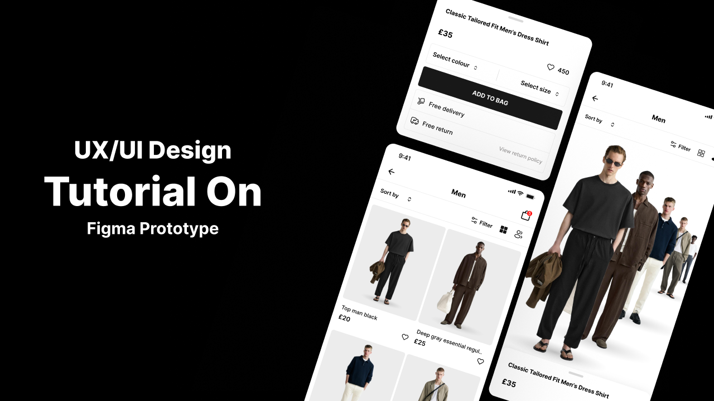
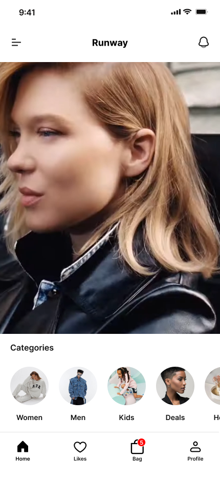
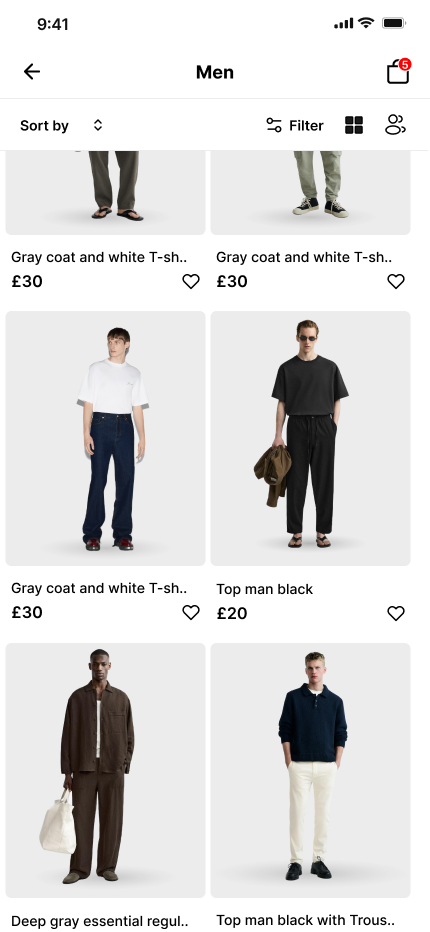
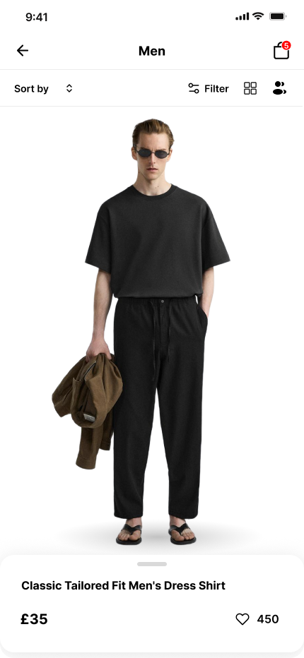
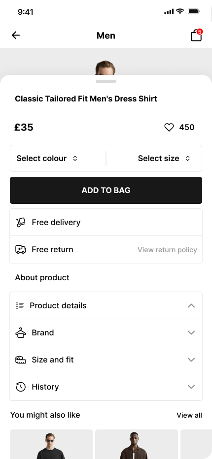

# 👗 Runway Fashion Slider App

<p align="center">
  
</p>

<div align="center">

## ✨ A Modern Fashion Experience Built with Flutter

A stylish and interactive fashion application built with Flutter, featuring smooth sliders, elegant UI components, fashion banners, and detailed product views.


</div>

---

## 📌 Overview

**Runway Fashion Slider App** is a modern Flutter application designed to provide an elegant fashion browsing experience.

The application presents fashion collections through beautiful sliders, promotional banners, and detailed product screens with a clean and attractive user interface.

The project focuses on creating:

- 🎨 Modern fashion-inspired UI
- ⚡ Smooth animations and transitions
- 🧩 Reusable Flutter components
- 📱 Responsive layouts
- ✨ Premium user experience

---

# ✨ Features

## 🎞️ Fashion Slider

- Interactive image slider for fashion collections.
- Smooth transitions between featured items.
- Attractive visual presentation.

## 🏠 Home Screen

- Main application interface.
- Displays featured fashion items.
- Provides easy navigation through the app.

## 🎯 Details Screen

- Shows complete information about selected items.
- Large product images.
- Organized product details layout.

## 🖼️ Banner Section

- Promotional fashion banners.
- Highlights featured collections.
- Reusable banner components.

## 🚪 Lobby Screen

- Elegant introduction screen.
- Creates a premium first impression.

---

# 📱 Screenshots

## 🚪 Splash Screen

<p align="center">

</p>

---

## 🚪 Home

<p align="center">

</p>

<p align="center">

</p>

---

## 🏠 Lobby

<p align="center">

</p>

---

## 👗 Details

<p align="center">

</p>

---

# 🏗️ Project Structure


lib/
│
├── core/
├── features/
│   ├── authentication/
│   ├── home/
│   ├── cart/
│   ├── wishlist/
│   ├── profile/
│   └── checkout/
│
├── shared/
└── main.dart


---

# 🛠️ Technologies Used

| Technology | Description |
|------------|-------------|
| Flutter | Cross-platform application framework |
| Dart | Programming language |
| Material Design | UI design system |

---

# 🚀 Installation & Running

## Requirements

Make sure you have installed:

- Flutter SDK
- Dart SDK
- Android Studio or VS Code
- Android Emulator or Physical Device

---

## 🤝 Contributing

Contributions are welcome.

Fork the repository, create a feature branch, and submit a Pull Request.

---

## 📄 License

This project is licensed under the MIT License.

---

## 👨‍💻 Author

**Amir Yousry**

Flutter Developer

GitHub: https://github.com/amir-yousry

---

⭐ If you find this project useful, consider giving it a star.

## Clone Repository

```bash
git clone https://github.com/your-username/runway_fashion_slider_app.git
